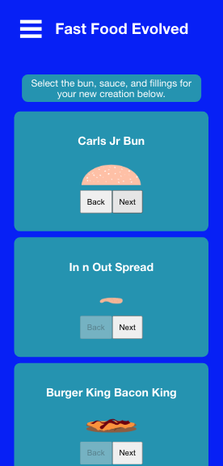
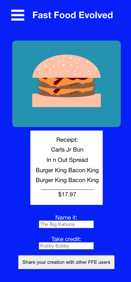
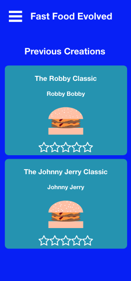

# Fast Food Evolved
https://fastfood-client.jordanhenn.vercel.app

## API Repo
https://github.com/jordanhenn/fastfood-api

## Summary
Fast Food Evolved is an app where you create fast food hybrids using items form different restaurantes. User starts by selecting buns, sauces, and fillings using carousel selections, finalizes their creation, calculates the price, and then has the option to post it to the site where it can be shared with other users or on their social media pages. 

## Tech Used
HTML, CSS, Javascript, React